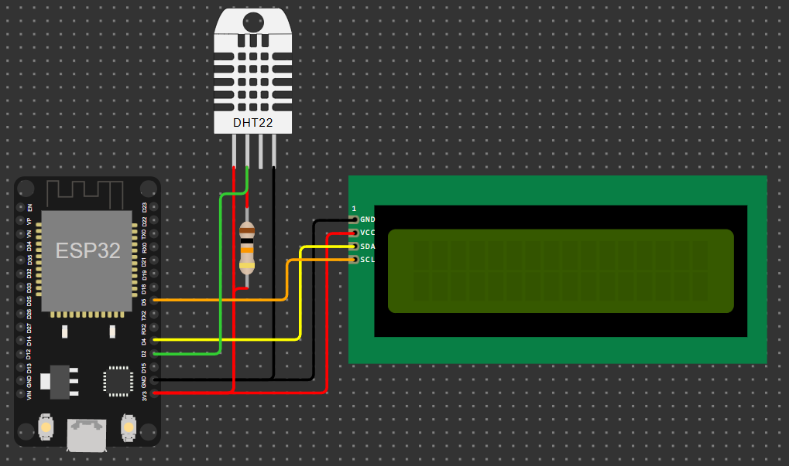

# ❓ What is this
This is the second version of the [Homelab](https://github.com/minion6011/Home-Lab) <br>
The HomeLab aims to be a website that works in localhost and that allows you to do various things through its sections:
- **Home** <br>
Allows you to turn off or restart the site, view system information, execute commands, get details about the ESP32 integration, send and receive requests, and access all other pages of the website.
- **Music Downloader** <br>
Allows you to download music from YouTube and play it on the site like Spotify
- **Cloud** <br>
  Similar to Google Drive; it allows you to upload files, edit them, rename them and create folders

# Installation Guide
<b>🍓 <a href="Guide_Raspbian.md">Raspbian</a> </b>
<br>
<b>🪟 <a href="Guide_Windows.md">Windows</a> </b>
<br>

## • Setup ESP32 integration - Thermometer
Required components: 
- ESP32
- DHT11/DHT22 (the circuit was made to use a DHT11)
- LCD 16x2 (I2C)
- 10KΩ resistor
- Jumper Wires
  

<br>

## • Setup ESP32 integration - Thermometer Lights
Required components: 
- ESP32
- 3 Leds (Colors: Red, Yellow, Green)
- Jumper Wires


<hr>
<br>

After creating the circuit as in the photo, you need to install MicroPython on the ESP32; I suggest using [this guide](https://docs.sunfounder.com/projects/esp32-starter-kit/en/latest/micropython/python_start/install_micropython.html).
<br><br>
Add the code present in the `code esp32` folder inside the ESP32 files, depending on which Integration you are making use folders `ESP32_Thermometer` or `ESP32_Lights`
<br><br>
Edit the `boot.py` file and add the Wi-Fi SSID and password to the dictionary and the Homelab ip


# Changelog
```diff
+ Reworked all the css
+ Added PWA support to the Music section
+ Added new controls to the Music section: Next Song, Sync with PWA and Play/Pause button, Previous Song (restarts the current track)
+ Improved audio playback management in the Music section
+ Added loading indicator when uploading a file in the Cloud section
+ Added password protection to access the Index page
+ Moved the API tool to the Index page
+ Enabled access to all website pages from the Index page
- Removed the file editor from the Cloud section
- Removed Streaming Community integration
```
